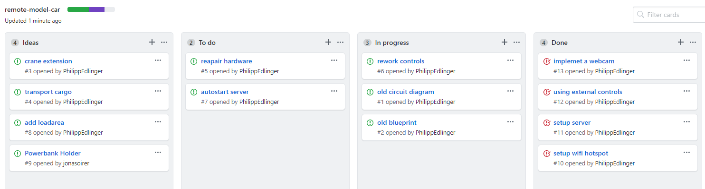

## Sachstandsbericht
#### Projekt: remote-model-car

### Projektleiter
Jonas Oirer

#### Projektmitarbeiter
Philipp Edlinger

#### Laufzeit des Vorhabens
14.10.2019 - 26.6.2020

#### Status

#### Projektverlauf 

   Link: https://htl-leonding-project.github.io/remote-model-car/#_gantt_chart

- Konfiguration eines Wlan-Hotspots am Raspberry Pi
- Verbindungsaufbau zum Server
- Client-Server- Kommunikation hergestellt
- Steuerung mittels JoySticks umgesetzt
- Bildschirmübertragung mittels Webcam ermöglicht
- Github Pages und Projects erstellt

#### Ziele
   
   Link: https://github.com/htl-leonding-project/remote-model-car/projects/1
   
- Steuerung überarbeiten
- Bau- und Schaltplan aktualisieren
- Hardwareteile reparieren bzw. erneuern
- Automatisieren des Serverstartes 

